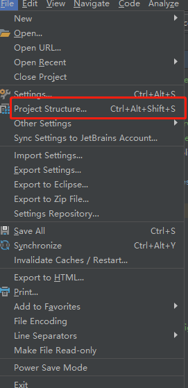

<h3>工程目的：</h3> 
<ul>
    <li>幂等性：
    <ul>
        <li>新增幂等性</li>
        <li>修改幂等性</li>
    </ul>
    </li>
    <li>秒杀分析：
    <ul>
        <li>只是最简单的查询库存大于0，然后库存减1。jmeter 10个线程模拟并发访问商品（10个库存），出现丢失更新，结果几乎都不为0</li>
        <li>使用java synchronized关键字加在service上，jmeter并发访问都没有问题，但随着线程增多出现了等待时间直线上升的情况，使用改关键字若多实例便失去作用</li>
        <li>使用数据库乐观锁，</li>
    </ul>
    </li>
    <li>异步消息一致性分析</li>
</ul>

<h3>记工程建立出现的问题：</h3> 
<ul>
    <li>单独建立spring boot 工程，使用bootstrap.properties配置会导致工程无法获取到配置数据，需改为使用application.properties；若必须使用bootstrap.properties，需引入spring cloud context依赖。</li>
    <li></li>
    <li>idea下application.properties文件中提示不认识某配置参数，或配置文件图标异常，是因为idea没有识别到该工程是spring工程，需要在idea->file->project structure->对应工程->配置工程为spring工程
     
step 1:

    
    
step 2:
</li>
    <li></li>
    <li>windows 下redis key 失效监听时，发现配置了notify-keyspace-expired Ex但依然没有作用,最终发现windows下redis默认读取的配置文件是另一个，导致无法监听，因此启动时指定配置文件即可 redis-server.exe ./redis.windows.conf</li>
</ul>

